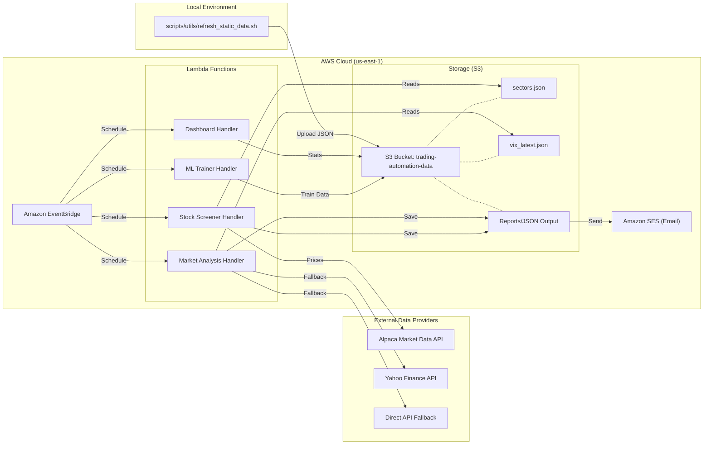
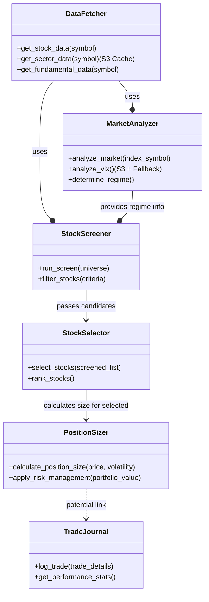

# System Architecture & Building Blocks

This document provides visual representations of the QuantZ Trading System's architecture, including its internal Python building blocks and its external cloud infrastructure.

## 1. High-Level Architecture (AWS System)

The system operates as a serverless application on AWS.
**Key Update (Jan 2026)**: A "Hybrid Data Fetching" strategy was implemented to resolve IP blocking issues for VIX and Sector data. Static data is now fetched locally and pushed to S3, while dynamic data is processed by Lambda.

## 2. Internal Building Blocks (Python Modules)

The logic is organized into modular components in `src/modules`.

## Note on Data Flow
1.  **Market Analysis** runs first to determine the Regime (Bull/Bear).
2.  **Stock Screener** uses the Regime to adjust filtering criteria (Aggressive/Defensive).
3.  **Data Fetcher** handles the complexity of S3 Caching vs Live API calls transparently.
